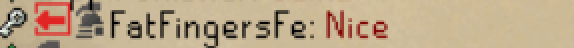

# Offline Clan Chat Icon
A super simple plugin that displays a logout icon next to the player's name if they leave the clan chat
or log out, and they have messages in the chat window.

I created this plugin because when someone left the clan chat, it used to show the guest icon for them if they were a clan member. I guess it was a bug and patched a few weeks ago. However, it had become more of a "feature" for my clan because it was nice to know if someone logged in and they couldn't see your chat. So I created this to act as it did.

